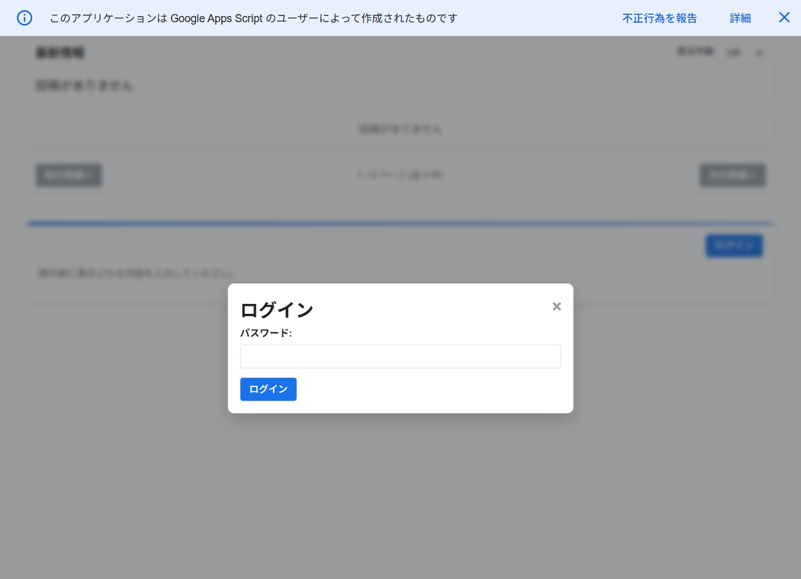
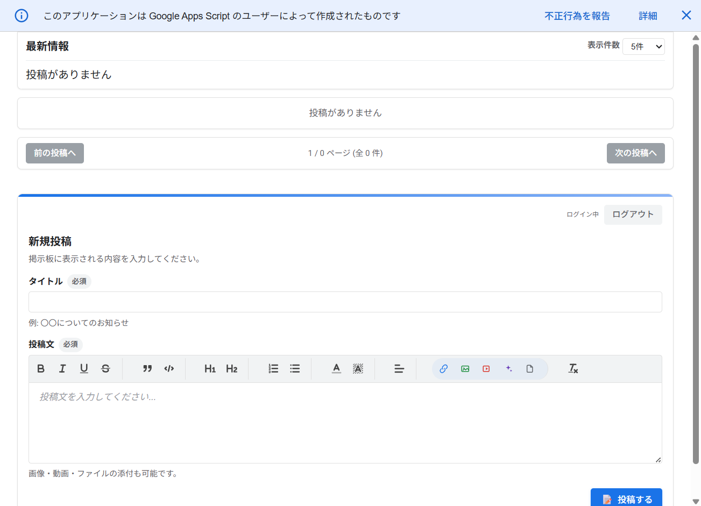
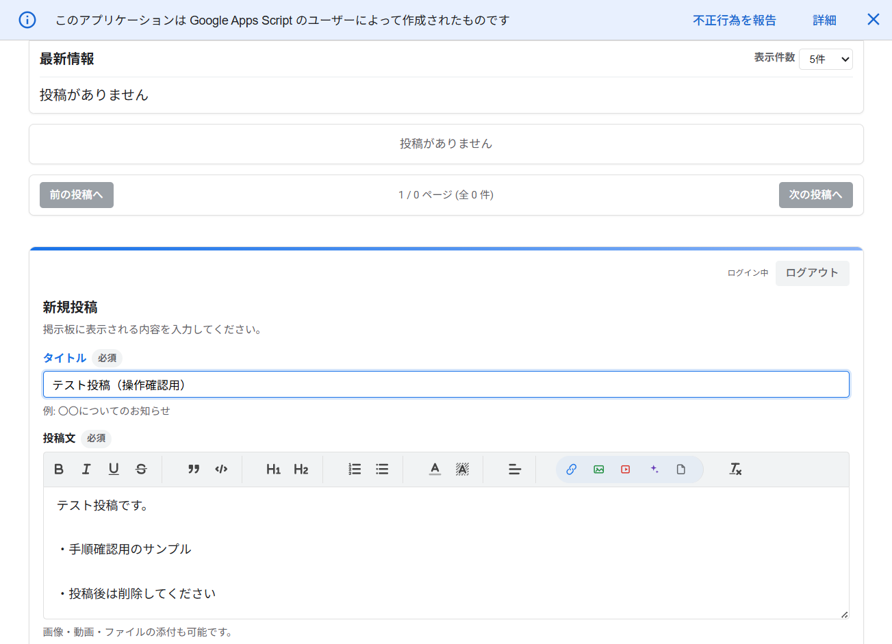
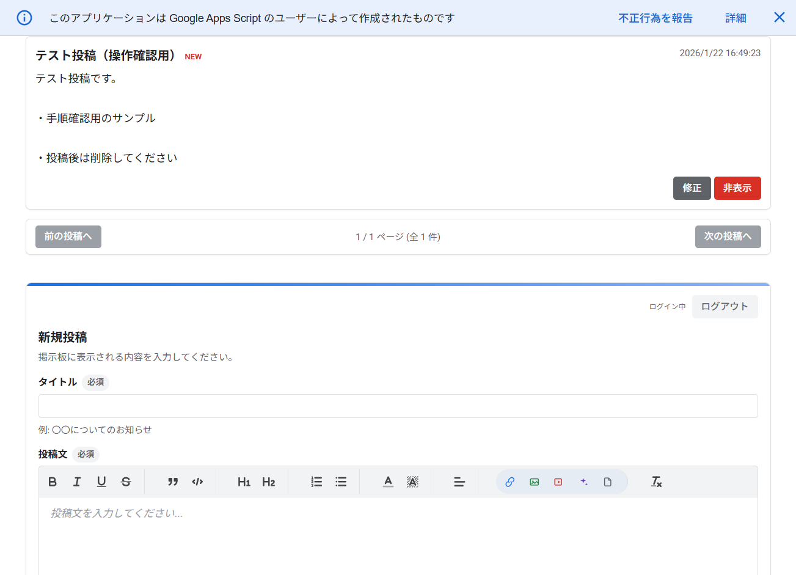

# ai-bbs

Google Apps Script で動作する掲示板 Web アプリです。スプレッドシートをデータストアとして利用し、投稿の作成・編集・非表示・最新情報の表示を行えます。

## 参照スプレッドシート
以下の URL からテンプレートをコピーして利用してください。

- https://docs.google.com/spreadsheets/d/1OP1LWa2ngMG3dZFcvoG9Tn9RoEkIPeg4PVHregMVsYI/copy

## セットアップ
1. 参照スプレッドシートをコピーし、拡張機能 > Apps Script を開きます。
2. このリポジトリのファイルをプロジェクトに反映します（clasp 推奨）。
3. Apps Script の「プロジェクトの設定 > スクリプト プロパティ」に `apikey` を追加します。
   - 名前: `apikey`
   - 値: Gemini API のキー
4. 初回アクセス時に「環境設定」シートが自動作成されます。
   - B1: パスワード
   - B2: 保存フォルダ名（Drive に作成）
   - B3: 表示件数

## デプロイ
Apps Script の「デプロイ > 新しいデプロイ」から Web アプリとして公開し、発行された URL で動作確認してください。

## 使い方（Web アプリ）
1. 画面右下の「ログイン」からパスワードを入力します。
2. 「新規投稿」でタイトルと本文を入力し、必要に応じて画像/動画/ファイルを添付します。
3. 「投稿する」で公開され、最新情報と一覧に反映されます。
4. 投稿の編集/非表示は各投稿の「修正」「非表示」から行います。
5. 「表示件数」で一覧の表示数を切り替えます。

## 画面例




## 投稿フォームのアイコン一覧
投稿文エディタ（Quill）のツールバーは下記の機能を持ちます。


| アイコン | 機能 | 補足 |
| --- | --- | --- |
| 太字 | 文字を太字にします | トグル形式 |
| 斜体 | 文字を斜体にします | トグル形式 |
| 下線 | 文字に下線を付けます | トグル形式 |
| 取り消し線 | 文字に取り消し線を付けます | トグル形式 |
| 引用 | 引用ブロックを挿入します | 段落単位 |
| コードブロック | コード表示用のブロックを挿入します | 等幅表示 |
| 見出し1 / 見出し2 | 見出しスタイルを設定します | 文書構造用 |
| 番号付きリスト | 連番のリストを作成します | `1.` 形式 |
| 箇条書き | 箇条書きリストを作成します | `-` 形式 |
| 文字色 | 文字色を変更します | パレット選択 |
| 背景色 | 文字背景色を変更します | パレット選択 |
| 配置 | 左/中央/右/均等の配置を切り替えます | 段落単位 |
| リンク | URL リンクを挿入します | テキスト選択で挿入 |
| 画像 | 画像をアップロードして挿入します | Drive に保存 |
| 動画 | 動画 URL を埋め込みます | 対応サービスのみ |
| 文章を自動生成 | 入力文から文章を生成します | `apikey` 必須 |
| ファイルを添付 | ファイルをアップロードしてリンクを挿入します | Drive に保存 |
| 書式クリア | 選択範囲の書式を解除します | 既存書式のリセット |

## 投稿手順（例）
1. タイトルと本文を入力します。



2. 「投稿する」を押すと、最新情報と一覧に反映されます。



## 主要ファイル
- `Code.js`：サーバー側ロジック（Sheets/Drive 連携、認証、ページングなど）
- `generate_text.js`：Gemini API で投稿文を生成する補助ロジック
- `index.html`：UI テンプレート
- `javascript.html`：クライアント側の操作ロジック
- `stylesheet.html`：スタイル定義

## 開発・同期（clasp）
```bash
clasp login
clasp push
clasp pull
clasp open
```

## 設定メモ
- スクリプトプロパティ `apikey`：Gemini API 用キー
- シート「環境設定」：パスワード、保存フォルダ名、表示件数
